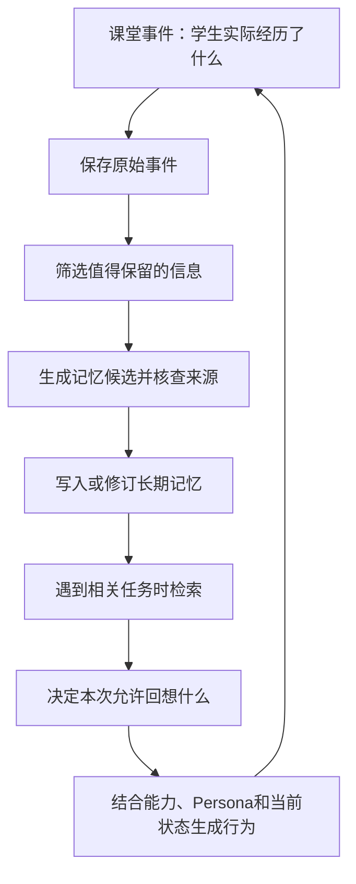

# 三 Agent 课堂 · 设计对话

讨论开始：2026-09-30；更新至：2026-10-09

仅收录 Agent 课堂构建方法相关的用户提问与正式答复；分享、网页生成、部署及页面维护对话不在收录范围内。

## 从 AI 课堂的想法出发

### 用户

我想自己搭建一个Ai老师和AI助教的两个Agent共存的课堂，你能配合我一步一步的搭建起来么？

### AI

可以。我们一步一步搭，每一步都做出能运行、能体验的东西，再根据你的反馈往下走。

先做一个最小课堂，让三个角色能完成一次教学互动：

- **AI 老师**：讲解、提问，根据学生回答推进教学。
- **AI 助教**：在学生卡住时提供提示，帮助老师了解学生的困难。
- **学生**：回答问题，也可以主动向助教求助。

关键是设计清楚：**谁在什么时候说话、两个 Agent 怎么共享课堂信息，以及如何避免抢话或重复解释。** 我会配合你把教学流程、角色分工、技术实现和实际测试逐步做起来。

我们先确定第一件事：**你想给什么样的学生、上一堂什么内容的课？** 比如“给 5–8 岁孩子上的英语口语课”，或者你已经有的一节具体课程。

## 让学生成为第三个 Agent

### 用户

哦，学生设计成第三个Agent吧

### AI

好，那我们做一个 **AI 老师＋AI 助教＋AI 学生** 的三 Agent 模拟课堂。你作为观察者，可以随时暂停、调整角色设定，再重新运行。

三个角色先这样分工：

- **老师 Agent**：围绕教学目标讲解、提问，并判断是否继续。
- **助教 Agent**：观察学生表现，在需要时提示或辅助，避免抢老师的话。
- **学生 Agent**：按照设定的年龄、知识水平和性格回答，可以答错、听不懂或走神。

学生需要有独立的信息边界，只看到课堂上已经发生的内容，避免提前看到老师的答案，影响模拟效果。

第一步先确定场景：**你希望这位 AI 学生模拟哪个年龄段、什么水平，学习什么内容？**

## 覆盖 3–15 岁与多地区学生

### 用户

我需要3-15岁，每一个年龄都能有一些学生的persona，来模仿各个年龄各个风格的学生
我的学生分布在东南亚、沙特、韩国、日本
他们不一定只学习英语，可能也会学习其他校内学科

### AI

明白。学生 Agent 要做成一个**可切换 persona 的学生库**，覆盖 3–15 岁、多个地区和学科，而不是固定扮演某一个学生。

我们可以先按**每个年龄 3 个不同的学生，共 39 个基础 persona**起步，再加入地区、语言和学科背景。每个 persona 分成四层：

- **年龄与学习背景**：年龄、年级、上学经历、已有知识。年龄相同，能力也可以不同。
- **地区与语言**：所在国家、家庭语言、教学语言，以及用教学语言表达的熟练程度。地区用于补充语言和课程背景，不用来预设性格。
- **个人学习风格**：主动或慢热、谨慎或急于作答、是否愿意求助、遇到挫折的反应。这些特征可以组合，不把孩子固定成“好学生／差学生”。
- **各学科能力**：英语、数学、科学等分别设定。例如，数学理解很好，但用英语解释解题过程比较困难。

此外，还要把**稳定的 persona**和**当堂状态**分开。同一个学生今天可能很投入，下一次可能疲倦；课堂中的成功、困惑和老师的反馈，也应该影响后续表现。

例如，一个虚构学生可以是：

> 8 岁，生活在日本，家庭语言是日语。数学计算较熟练，英语表达较弱。愿意尝试，但怕当众答错；听不懂英文数学题时，可能先猜答案。得到具体提示后会继续尝试，不会因为老师说一句“再想想”就突然掌握知识。

后续模拟时，学生只能依据自己的知识和已发生的课堂内容回答；我们还会检查它是否出现了超出设定水平、过度配合老师的情况。

先补齐一个会影响语言和课程配置的信息：**东南亚具体覆盖哪些国家？**

## Persona 的定义、常量与变量

### 用户

在回答你东南亚具体覆盖的国家之前，我想先跟你讨论下，你怎么定义什么是persona，如何写清楚或者定义清楚一个Agent的persona，哪些应该是这个persona的常量哪些是变量。以及构建一个学生Agent，除了有persona以外，还需要什么

### AI

我建议先把一个边界定清楚：**persona 描述“这个学生通常是怎样的人”；完整的学生 Agent 还要描述“他现在会什么、经历过什么，以及此刻如何反应”。**

我前面提出“每个年龄先做 3 个 persona”，只是一个起步数量，并没有解决该如何定义和验证它们。现在先把结构讨论清楚更合适。

**先说什么是 persona。**

在我们的项目里，我建议用这个工作定义：

> Persona 是一组相对稳定、能影响行为的个人背景、动机、偏好和反应倾向，让同一个学生在不同课堂情境中保持可辨认的一致性。

其中，“相对稳定”和“影响行为”最重要。

“8 岁，生活在日本，喜欢恐龙”提供了背景，但不足以决定课堂行为。还需要知道：他为什么愿意参与？不确定时会猜、沉默还是求助？老师纠正他以后，他通常如何回应？

同时，persona 应该表达**倾向，而非每次必然执行的动作**。一个慢热的学生，遇到熟悉的话题也可以主动说话；喜欢恐龙，也不代表每句话都要提恐龙。

**怎样把 persona 写清楚？把形容词写成有条件的行为。**

例如，只写“内向、容易受挫、需要鼓励”，不同模型可能演出完全不同的学生。我会把它展开成：

> 面对陌生老师和开放式问题，通常先等待，回答较短。\
> 面对熟悉知识的选择题，即使没有被点名，也可能主动回答。\
> 连续尝试失败后，更倾向于说“不知道”或减少参与。\
> 老师指出已经做对的部分，并提供一个可执行的小提示后，更愿意重试。\
> 鼓励可以提高尝试意愿，但不会直接补齐缺失的知识。

这段定义交代了**触发情境、行为倾向、变化条件和能力边界**，后续就能用课堂片段检验。

每个关键特征都应该能回答：

- 什么情况下会表现出来？
- 会表现成什么可观察的行为？
- 什么情况下会减弱，或者出现例外？
- 我们拿什么例子判断它有没有演对？

没有数据依据时，我不建议一开始写“内向程度 0.8”“答错后有 70% 概率沉默”。这些数字需要明确含义和校准，否则只是看起来精确。

**常量和变量，要根据变化的时间尺度区分。**

我建议分成四类，而不是只分“固定／不固定”。

1. **一次模拟中固定的背景**\
   年龄、家庭语言、所在地区、既往教育经历等。它们不能因为几轮聊天突然改变。跨学期模拟时，年龄、年级等可以按时间推进。

2. **缓慢变化的个人倾向**\
   主动表达的倾向、面对不确定性的习惯、兴趣、通常如何求助等。这些构成 persona 的核心。短期内保持稳定，长期变化需要有持续经历作为依据。

3. **随学习经历更新的能力和记忆**\
   掌握的知识点、常见误解、教学语言熟练度、对某类题目的信心，以及与老师、助教的互动经历。建议单独保存，避免把“不会分数”永久写进性格设定。

4. **随课堂事件变化的即时状态**\
   当前注意力、困惑、疲劳、挫败感、参与意愿，以及“这道题有没有听懂”。它们可以在几轮互动中变化，但需要有原因。

例如，“通常敢于尝试”属于个人倾向；“刚连续答错，现在不想开口”属于即时状态，两者可以同时成立。

还有一个容易遗漏的区别：**创建学生时可配置，不等于运行中可以随意变化。** 我们可以在创建时选择年龄，但不能让模型在课堂里自行修改年龄。

**除了 persona，学生 Agent 还需要下面几部分。**

**① 明确的知识与能力模型。**\
要具体到当前课程涉及的知识点：会什么、不会什么、哪里有误解、需要什么帮助。多学科场景尤其要把“学科理解”和“教学语言理解”分开。

例如，学生可能会用母语解决一道数学题，却听不懂英文题干。此时给数学提示和翻译题干，应该产生不同效果。

学生模拟研究也指出，大模型本身能力很强，仅靠角色提示扮演初学者，容易产生不合理的错误和学习过程；需要明确限制模拟学生可用的知识，并定义知识如何更新。[相关研究](https://arxiv.org/abs/2601.05473)

**② 独立的信息边界。**\
学生只能根据自己实际接收到的课堂信息行动。老师的教案、标准答案、助教的内部判断，不能直接混入学生上下文。

在三 Agent 课堂里，还要明确：助教是在对学生说话，还是在给老师发内部消息？学生是否听到了这句提示？这些都会改变下一步反应。

**③ 记忆。**\
学生需要记得刚才尝试了什么、接受过什么提示，以及之前与老师和助教发生过什么。

不过，“刚听过一个答案”和“已经掌握这个知识”要分别记录。记住原题答案，不代表换一道题也会。

**④ 行为选择机制。**\
每轮先决定学生要采取什么行动，再生成具体表达。可选行动可以包括回答、猜测、追问、求助、沉默、请求重复、转移话题等。

这样才能模拟“他选择不回答”，而不是系统每收到一条消息，就强迫学生说出一句完整的话。语音课堂还需要考虑等待、打断，以及非语言操作。

**⑤ 学习和状态更新规则。**\
老师讲解、助教提示之后，什么发生了变化，必须有明确规则。

例如：

- 泛泛的鼓励，可以提高参与意愿。
- 提供一个步骤，可以帮助完成当前题目。
- 独立解决一道变式题，可以作为掌握程度提高的证据。

这些先作为我们的建模假设，之后再用真实课堂记录校准。不能让学生只因为老师说“你明白了吗”，就自动进入“已经学会”的状态。

**⑥ 课堂调度和验证机制。**\
课堂调度负责决定谁可以发言、谁接收消息、沉默后等待多久。这属于课堂系统，不需要再设一个有 persona 的角色。

验证则检查两件不同的事：**行为是否符合这个学生，以及他对教学的反应是否合理。** 近期学生模拟研究也将行为匹配和接受指导后的变化分别评估。[StudentSim 研究](https://arxiv.org/abs/2609.01591)

我们还需要保存初始状态和运行记录，才能让同一个学生从相同起点体验不同教学方案。否则，老师方案变了，学生状态也变了，很难判断差异来自哪里。

用一个完整例子串起来：

> 同一个学生，通常谨慎，怕在陌生老师面前答错。\
> 他会做两位数加法，但没有理解进位；当前精神状态不错。\
> 老师第一次问进位题，他尝试用已有方法回答，出现与误解一致的错误。\
> 老师只说“加油”，他可能愿意再试，但仍然不会进位。\
> 助教用实物分组演示，他在帮助下完成这一题。\
> 系统记录“在提示下完成”，再通过新题观察能否独立应用。

这里，**persona 决定他如何面对困难，知识模型决定困难在哪里，课堂经历决定他接下来可能发生什么变化。**

所以我建议下一步先做**一个学生的完整定义，以及几段用于检验他的课堂情境**。先确认我们能稳定模拟一个“有边界、会变化”的学生，再扩展到 3–15 岁和不同地区。

## 能力和记忆如何存储

### 用户

你提到单独保存随学习经历更新的能力和记忆，这个具体研发侧如何操作？

### AI

具体研发上，我建议：**把学生的能力、记忆保存到我们自己的数据库里，由程序负责读取和更新；大模型负责根据这些信息生成学生行为。**

这里的“学习”首先体现为数据库中的学生状态发生变化，**不涉及每上完一节课就训练或修改大模型参数**。第一版可以用这种方式实现。

我用“学生学会数学进位”这个例子展开。

**1. 把 persona、能力、记忆分别存储，用同一个学生 ID 关联。**

研发可以先建立以下几类数据，初期放在同一个数据库即可，不需要拆成多个服务。

- `student_profiles`：学生背景和相对稳定的 persona。
- `student_skill_states`：按知识点保存的能力状态。
- `student_memories`：课堂中发生过的、值得后续使用的经历。
- `classroom_events`：完整的课堂事件记录，便于回放和核查。

能力状态不能只写“数学水平：中等”，而要具体到当前教学涉及的知识点。例如：

```json
{
  "student_id": "student_008",
  "simulation_id": "run_001",
  "skill_id": "math.addition.carry",
  "status": "with_support",
  "misconceptions": ["把个位相加的两位数直接写进个位"],
  "evidence": {
    "independent_successes": 0,
    "supported_successes": 1
  },
  "last_evidence_event_id": "event_023",
  "version": 4
}
```

这里的 `with_support` 表示“在帮助下能完成”。第一版可以先采用“未接触、正在学习、提示下完成、独立完成”等可解释状态，不急着使用看似精确的掌握概率。

记忆则记录经历：

```json
{
  "student_id": "student_008",
  "simulation_id": "run_001",
  "type": "learning_episode",
  "summary": "助教用十根小棒换一捆的演示，帮助我完成了进位题。",
  "related_skill_ids": ["math.addition.carry"],
  "source_event_ids": ["event_021", "event_023"]
}
```

**这两条数据表达不同的东西：能力说明“现在能做到什么”，记忆说明“之前经历过什么”。** 学生可以记得一次演示，但还不能独立完成新题。

**2. 每次轮到学生行动，程序组装这一次所需的上下文。**

不需要把学生全部历史塞给大模型。课堂程序按当前任务读取：

1. 学生的 persona。
2. 当前题目涉及的能力与误解。
3. 当前注意力、困惑等即时状态。
4. 与当前任务有关的少量记忆。
5. 学生有权限看到的课堂消息。

例如，当前教进位，就读取加法、数位、进位相关状态，不必加载全部英语学习记录。

然后调用学生模型，让它返回结构化的行动：

```json
{
  "action": "answer",
  "utterance": "是三十二吗？",
  "help_requested": false
}
```

**学生模型生成“怎么表现”，不直接修改自己的能力数据库。** 它说“我懂了”，只能算一次课堂表达，不能自动当作掌握证据。

**3. 能力更新由独立的更新逻辑控制。**

这里的“独立”可以只是后端的一段函数，不需要额外增加一个有角色设定的 Agent。

第一版我建议用“固定规则＋必要时调用模型判断”的方式：

- 程序能直接判定的，使用规则，例如答案是否正确、之前是否给过提示。
- 开放式回答需要理解时，调用模型进行结构化评估。
- 评估结果交给程序校验，再决定是否更新数据库。

例如，一次回答结束后产生这样的证据：

```json
{
  "event_id": "event_023",
  "skill_id": "math.addition.carry",
  "answer_correct": true,
  "support_level": "step_by_step",
  "task_type": "original_question"
}
```

更新程序据此判断：这是在逐步帮助下完成原题，可以增加“提示下成功”的记录；不足以直接改成“独立掌握”。

每次修改还应保留：**修改前是什么、修改后是什么、依据哪条课堂事件、用了哪个版本的更新规则。** 出现“学生突然变聪明”的问题时，研发可以追溯。

**4. 模拟学生还有一个特殊问题：教学怎样让他获得新能力？**

这里需要区分两个环节：

- **模拟学习发生**：学生收到讲解或提示后，按我们设定的学习规则，更新其模拟知识状态。
- **观察学习表现**：后续通过独立作答、变式题等，观察其表现是否支持更高的掌握判断。

例如，第一版可以设定：

> 接收到相关演示，并参与完成一个步骤后，将该知识点从“正在学习”更新为“提示下完成”；后续满足预设的独立作答条件，再更新为“独立完成”。

这是一条**模拟规则，需要校准**。不能把它当成真实儿童必然遵循的学习规律，也不能因为规则规定学生会进步，就反过来认定老师教得有效。

研发上最好同时保留“模拟器内部能力状态”和“老师根据表现估计的能力”。老师只能看到课堂行为和允许共享的评估结果，不能直接读取学生内部设定，否则测试会失真。

**5. 把这些步骤串成一次完整的运行。**

每轮课堂的执行顺序可以是：

```text
老师／助教发出消息
        ↓
程序判断学生是否能接收到，并记录事件
        ↓
按规则处理提示、讲解对学生状态的影响
        ↓
读取 persona、相关能力、记忆和当前状态
        ↓
调用学生模型生成行动
        ↓
记录行动，评估本次表现
        ↓
更新能力、即时状态和相关记忆
        ↓
进入下一轮
```

能力更新和记忆写入需要关联同一事件，重复处理时不能重复累计；更新时检查状态版本，防止老师和助教的并发消息互相覆盖学生状态。

另外，**给模型提供能力设定，并不能完全保证它不使用自身已有知识**。我们还要检测超出设定的回答，记录违规，必要时重新生成或判定这次模拟无效。

**6. 同一个学生要支持“继续学习”和“从原点重跑”。**

这是数据库设计里很重要的一点。

假设我们想比较两种老师讲法，就应该从同一份初始快照分别启动：

- 模拟 A：学生初始状态 → 老师方案 A → A 的能力与记忆。
- 模拟 B：同一初始状态 → 老师方案 B → B 的能力与记忆。

A 学到的东西不能自动带进 B。因此上面的数据都有 `simulation_id`。只有选择“继续这个学生的下一节课”时，才继承上次运行结束后的状态。

第一版的研发交付可以很具体：**一个数据库、一个学生生成接口、一套受控的状态更新规则，以及一个能查看“每轮前后发生了什么变化”的调试页面。** 先把这条链跑通，就能验证学生是否真的表现出连续的学习经历，再逐步增加 persona 数量。

## 课堂中何时读取与更新状态

### 用户

把学生的能力、记忆保存到我们自己的数据库里，由程序负责读取和更新；大模型负责根据这些信息生成学生行为。
这里，应该在什么时候读取和更新？是需要在学生student首次启动的时候读取，然后整个课堂中都使用这个能力与记忆，还是说课程进行中，还需要分阶段更新数据库，并更新给学生Agent？

### AI

**课程进行中需要持续更新，并把相关变化提供给学生 Agent 的下一次调用。** 只在启动时读取一次，会让学生一直按照“上课前的自己”行动。

不过，**每次调用都使用最新状态，不等于每次都重新查询全部数据库。** 研发上可以把“读取数据库”“更新运行状态”“保存数据库”分开处理。

我建议第一版采用：**开课时加载，每次学生行动前准备最新上下文，每个有效互动结束后保存变化。**

**开课时：加载这个学生的起点。**

从数据库读取：

- persona；
- 本节课相关的知识能力；
- 与本节课有关的历史记忆；
- 上次结束时需要继承的状态。

程序把它们放进这堂课的“运行状态”里，也就是后端内存中的一个学生状态对象。后面课堂中的更新先作用于这个对象。

这样，不必每说一句话，都从数据库重新加载整个学生。

**课堂中：在有意义的事件后更新，而不是固定每隔几分钟更新。**

不同事件需要更新的内容不同：

- **老师提出问题**：可能改变困惑程度、当前任务，不代表知识增加。
- **助教给出提示**：记录学生已经获得什么帮助，必要时更新当前理解或可完成的步骤。
- **学生完成回答**：记录作答结果、是否依赖提示，并按规则更新能力证据。
- **进入新知识点**：加载新知识点相关能力和历史记忆。
- **一段教学结束**：整理这一段值得保留的记忆，保存阶段快照。

不是每个事件都修改能力。例如，“老师说了句你好”需要记录对话，但通常不需要改变数学能力。

**每次轮到学生行动前：使用最新状态构建输入。**

这是最关键的一步。可以把它理解成：每次学生要说话或做动作，程序都重新准备一份“此刻的学生资料”。

这份资料包括稳定的 persona、最新的相关能力、当前状态、已收到的提示和近期对话。即使 persona 没变，能力或状态变了，下一次调用也必须体现变化。

对于常见的大模型 API，**数据库中的修改不会自动被模型知道**。必须由我们的程序把最新数据放进下一次请求。即使沿用同一段对话，也要明确提供当前状态，避免旧设定继续生效。

拿一段进位教学举例：

1. **开课**：加载“会不进位加法，尚不会进位”。
2. **老师提问**：学生按当前能力尝试，答错；程序记录错误，更新困惑状态。
3. **助教演示**：程序记录演示已被学生接收，按模拟规则更新为“可以尝试跟着步骤做”。
4. **学生再次回答前**：把这个最新状态和演示内容一起交给模型，学生现在可以利用帮助。
5. **学生在帮助下答对**：保存“提示下完成”的证据，仍不直接认定独立掌握。
6. **老师出一道新题**：下一次调用使用更新后的能力，但不自动附带上一题的逐步提示，观察学生如何迁移。

如果只在开课时加载且后面不更新，第 4 步可能仍然表现得完全没学过；如果任由对话历史决定一切，又可能听完演示就突然变成全会。

**写数据库：第一版按每个有效互动保存，课末再做整理。**

我建议：

- 每条课堂事件发生后，及时保存事件记录。
- 能力、状态确实变化后，保存增量变化及其依据。
- 一个教学环节结束时，整理长期记忆。
- 课程结束时，保存最终状态和下次可继承的记忆。

没有必要每轮都生成一份长期记忆；原始事件先保留，重要经历再整理。例如，“老师刚说了一句鼓励”可以先在近期对话里，“多次具体提示后重新愿意尝试”才可能值得形成一条长期记忆。

还有一条研发约束：**同一个学生的状态更新应按事件顺序处理；一次模型调用使用一份固定版本的状态。** 如果学生生成回答时助教又发来新提示，要明确让它进入下一轮，或者取消当前生成后重试，不能让一次回答对应两个不同版本的学生。

所以，你提出的两个方案中，我们应采用**“启动时加载＋课中按事件更新＋下次行动前提供最新状态”**。阶段节点适合整理记忆和保存快照，影响当前行为的变化则应及时生效，不必等到一个阶段结束。

## 独立完成与帮助下完成

### 用户

那又是基于什么来判定，学生是在帮助下完成的，还是独立完成的呢？来得到这两个参数的值？
```json
"independent_successes": 0,
    "supported_successes": 1
```

### AI

这两个值应该由**程序根据作答结果和帮助记录累计**，不能让学生 Agent 自己报告“我是独立完成的”。

而且我前面的例子省略了一层：要先给每次任务生成一条判定记录，才能可靠地得到这两个计数。

**第一步，先定义这次任务允许学生使用什么。**

“独立完成”需要有明确条件。例如，本次任务规定：

> 学生可以看题目和配图，可以使用之前学过的知识；作答过程中没有收到针对本题的额外提示。

按照这个定义，之前上课学过解题方法，不影响独立完成。独立不是“从来没有被教过”，而是**完成当前任务时，没有依赖超出既定条件的帮助**。

对于你的多语言课堂，这个定义尤其重要：如果我们测数学，翻译题干可以被预先规定为允许的条件；如果测英文阅读理解，翻译题干就属于帮助。因此，判定要跟着教学目标走。

**第二步，记录作答前，学生实际接收过哪些帮助。**

老师和助教的课堂事件，都关联到具体任务，例如：

```json
{
  "event_id": "event_022",
  "task_id": "task_007",
  "recipient": "student_008",
  "type": "hint",
  "support_level": "step",
  "content": "先算个位，看看有没有满十。",
  "delivered_before_answer": true
}
```

这里可以先设计几种帮助类型：

- **鼓励或流程提醒**：“可以再试试。”通常不提供解题信息。
- **方向提示**：“注意个位有没有满十。”
- **步骤帮助**：“8 加 7 是 15，把 5 写在个位。”
- **答案提供**：“答案是 35，跟我说一遍。”

关键依据是**帮助内容、提供时间、接收者、对应任务**。助教给老师的内部建议，学生没有收到，就不能算学生获得帮助。

这些标签可以由课堂程序预先标注；自由生成的提示，则需要检查实际内容，避免把已经透露答案的话误标成“鼓励”。

**第三步，将“答案是否正确”和“是否得到帮助”分开判定。**

正确性由题目的评分规则决定：

- 数值题、选择题，可以用程序判分。
- 开放式回答，按明确的评分标准评估；必要时调用独立的评估模型。
- 证据不足时标为待定，不强行累计成功。

帮助情况来自事件记录。两者合并后，才能得到本次结果：

```json
{
  "task_id": "task_007",
  "answer_event_id": "event_023",
  "correct": true,
  "support_level": "step",
  "support_event_ids": ["event_022"],
  "outcome": "supported_success"
}
```

后端读取这个结果，再让 `supported_successes` 增加 1。

如果答案正确，而且记录确认作答前没有收到超出允许条件的帮助，就可以判为 `independent_success`，让对应计数增加 1。

**但“得到帮助后答对”还需要避免两种误判。**

第一，**直接复述答案不等于在帮助下完成解题**。我建议单独记录为 `answer_reproduction`，不要混进 `supported_successes`。如果任务目标本来就是跟读，则应按跟读任务的标准评分。

第二，**刚被告知答案，再把同一道题做对，不能直接算新的独立成功**。需要保留“之前见过本题答案”的记录。若想检查能否独立应用，应该安排未透露答案的新题或变式题。

例如，下面这段互动可以这样累计：

1. 学生第一次答错：两个成功计数都不增加。
2. 助教提供一个步骤，学生完成剩余步骤并答对：`supported_successes + 1`。
3. 老师给一道新的同类题，学生没有额外帮助就答对：`independent_successes + 1`。

同一次完成只累计一次，重试、消息重发或重复评估不能重复计数。底层保留全部作答记录，汇总计数按任务结果生成。

**还有一个需要准确表达的边界：这个方法判定的是“在什么帮助条件下完成”，不能直接证明“帮助导致了成功”。** 学生有可能本来就会，只是助教提前提示了；我们只能把这一题记为“有帮助条件下完成”，再用无提示的新题观察独立表现。

因此，研发真正需要保存的核心是：**题目、评分结果、帮助记录、时间顺序和判定依据**。这两个数字只是这些证据的汇总，也不能单独代表学生已经掌握了知识。

## 状态变更如何追溯

### 用户

这个具体在研发侧如何实现？我是个AI产品经理，我需要了解研发的实现方式，来评估我的文档应该怎么描述
每次修改还应保留：**修改前是什么、修改后是什么、依据哪条课堂事件、用了哪个版本的更新规则。** 出现“学生突然变聪明”的问题时，研发可以追溯。

### AI

研发侧可以把它实现为：**一份“学生当前状态”，加一份只能追加的“状态变更记录”。每次更新状态时，同时写入变更记录。**

你在产品文档里，重点要写清楚“哪些变化必须留痕、记录什么、如何查看，以及怎样算验收通过”，数据库表怎么拆可以交给研发决定。

我用一次具体变化来说明。

**假设学生在助教提示后，完成了一道进位题。**

更新前，系统记录：

> 进位能力：正在学习；提示下成功次数：0。

更新后，系统记录：

> 进位能力：提示下完成；提示下成功次数：1。

如果只覆盖当前状态，课后只能看到“提示下完成”，不知道它怎么来的。因此需要同时保留下面这条变更记录。字段名只是示例：

```json
{
  "change_id": "change_042",
  "student_id": "student_008",
  "simulation_id": "run_001",
  "task_id": "task_007",
  "target": "skills.math.addition.carry",

  "before": {
    "status": "learning",
    "supported_successes": 0
  },
  "after": {
    "status": "with_support",
    "supported_successes": 1
  },

  "evidence_event_ids": [
    "event_022",
    "event_023"
  ],
  "reason_code": "CORRECT_AFTER_STEP_HINT",
  "rule_version": "learning_rules_v0.3",

  "state_version_before": 7,
  "state_version_after": 8,
  "created_at": "2026-09-30T10:05:12Z"
}
```

这里有几个重要区别：

- **`before / after`**：实际改了什么，可以只记录被修改的字段。
- **`evidence_event_ids`**：依据是什么。例如 `event_022` 是助教提示，`event_023` 是学生回答。两条事件本身需要保存内容、发送者和顺序。
- **`reason_code`**：为什么满足更新条件，例如“逐步提示后回答正确”。它是业务判定理由，不需要保存模型的内部思考过程。
- **`rule_version`**：用的是哪一版学习更新规则。
- **`state_version`**：这个学生状态的第几次更新，用来确认先后顺序，避免互相覆盖。

**一次更新，在后端大致经过四步。**

1. **先保存课堂事件。**\
   记录老师或助教说了什么、学生回答了什么，并给每条事件分配唯一 ID。

2. **评估并生成变更方案。**\
   更新模块读取当前状态、相关事件和指定版本的规则，算出“哪些字段应该从什么改成什么”。

3. **检查这次变更是否合法。**\
   例如，关联的事件是否存在、是否属于这个学生和本次模拟、该事件是否已经处理过，以及状态有没有被另一条更新抢先修改。

4. **同时保存新状态和变更记录。**\
   对使用关系型数据库的第一版，可以把这两次写入放在同一个数据库事务里：要么都成功，要么都不生效。

第 4 步可以避免一种很麻烦的情况：学生能力已经变了，但记录保存失败，之后再也查不出原因。

如果评估环节需要调用大模型，通常先完成模型评估，再进入短暂的数据库事务；提交前重新检查状态版本。如果状态已经变化，就重新评估或重试，不能直接覆盖。

**“保存规则版本”不只是写一个版本号。**

研发还需要保留这个版本对应的实际规则。

例如：

> `learning_rules_v0.3`：在逐步提示下答对，累计一次提示下成功；不直接升级为独立完成。

后来改成 `v0.4`，旧版本仍应可查询。否则，日志虽然写着 `v0.3`，研发也无法知道当时到底执行了什么。

如果判定依赖大模型，还应关联一条评估记录，保留：

- 当时使用的模型标识；
- 评估提示词和评分标准的版本；
- 实际用于评估的输入或其可还原引用；
- 模型当时输出的结构化判定。

这样才能查看**当时实际判了什么**。仅保留模型名称、以后再调用一次，不保证得到同样结果。

**发现“学生突然变聪明”时，排查会沿着这条链进行。**

假设第 12 轮学生突然独立解决了难题：

先查看**第 12 轮生成回答时实际使用的状态版本和上下文记录**，再定位该状态之前的变更，最后打开对应的课堂证据和规则版本。

这能区分几类问题：

- **状态本身被错误提升**：检查更新规则或评估结果。
- **状态没有提升，但学生仍答得过强**：检查学生生成是否遵守能力限制。
- **数据库状态正确，但调用使用了别的版本**：检查上下文组装或缓存。
- **答案提前进入了学生上下文**：检查消息权限和题目答案泄露。

所以，除了变更记录，我建议你的文档增加一条要求：**每次学生生成行动，都要关联它实际使用的状态版本和输入记录。** 只记录数据库怎么变，还不足以解释学生当时为什么这样表现。

**产品侧可以提供一个简单的“学生状态历史”查看入口。**

打开某次模拟后，你能按课堂顺序看到：

> 第 7 轮｜进位能力：正在学习 → 提示下完成\
> 依据：助教步骤提示＋学生正确回答\
> 更新规则：v0.3\
> 状态版本：7 → 8

点击后查看原始课堂事件、评估结果和字段变化。这个页面供产品、研发和测试排查使用，学生 Agent 本身不需要读取整套审计记录。

如果发现判定错误，修正时也应该**追加一条更正记录，关联原变更**，保留原始过程。

你可以在 PRD 里直接这样描述：

> **学生状态变更追溯要求：**系统对学生能力、记忆及约定范围内的课堂状态进行持久化修改时，须记录变更前后值、所属学生和模拟、依据事件、判定原因、更新规则版本、状态版本及时间。当前状态与变更记录须保持一致。相同事件重复处理不得造成重复累计。每次学生行动须关联实际使用的状态版本与输入记录，支持从异常行为追溯至状态变化、判定结果和原始课堂证据。

对应的验收标准可以写成：

- 一次能力变化，可以查到修改前后值及原始证据。
- 同一事件重复提交，不会重复增加成功次数。
- 保存失败时，不会出现“状态已变、记录缺失”。
- 规则升级后，仍能查看历史变更所用的旧规则。
- 任意一次学生回答，都能查到当时实际使用的状态和上下文。
- 人工更正后，原记录和更正记录均可追溯。

不必要求第一版建设复杂的全量事件回放系统；**当前状态＋不可覆盖的变更记录＋调用输入关联**，就能覆盖你现在最关心的排查需求。

## 学习规则与年龄、地区、学科

### 用户

你这里提到了“学习规则”，这个学习规则是什么？不同年龄是否不同，不同年龄、不同国家，不同的科目是否也不同？我应该怎么设计？
**模拟学习发生**：学生收到讲解或提示后，按我们设定的学习规则，更新其模拟知识状态。

### AI

**“学习规则”就是：系统用什么机制，决定一次教学经历会让这个模拟学生发生什么变化。** 它需要考虑年龄、已有知识、语言能力和学科特点，但我建议采用“共同框架＋具体知识点规则＋个体参数”，不要为每个“年龄 × 国家 × 科目”分别写一套。

先修正我前面一个过于简化的说法：**“得到提示后答对，就把能力升级”主要是表现记录与能力评估规则，还不能完整代表学习过程。**

**需要区分三类规则。**

- **学习规则**：收到讲解、练习或反馈以后，内部知识如何变化。例如，原先不知道“十个一可以换成一个十”，演示后形成了这个概念的初步理解。
- **表现规则**：在当前知识、语言和课堂状态下，学生如何作答。例如，理解了进位，但计算时仍可能出错。
- **评估规则**：观察到这次作答以后，系统如何判断学生的掌握情况。例如，提示下答对只能增加相应证据，不能直接认定独立掌握。

知识追踪研究也区分了学习状态与作答表现：学生可能会却失误，也可能不会却猜对。因此不能把一次答对直接等同于知识增长。[CMU 的知识追踪说明](https://www.cs.cmu.edu/~listen/BNT-SM/lr-dbn.html)

对我们的模拟器来说，**学习规则负责改变内部状态，表现规则负责生成行为，评估规则负责解读行为**。三者要有关联，但不能混成一条“答对就升级”。

**年龄应该影响哪些地方？**

我建议年龄主要用于生成初始配置，再用具体能力覆盖默认值。例如：

- 能理解怎样的语言和指令；
- 是否具备当前任务需要的阅读、数量、符号等基础能力；
- 在我们的模拟设定里，能处理多长、多复杂的操作序列；
- 表达理解时，可以用指认、操作、短句还是较完整的解释。

这些应该作为可配置、需要校准的特征，不能直接写成“5 岁要教五遍，10 岁教两遍”。

例如，两个同为 8 岁的学生，一个已经理解数位，一个还没有理解，面对相同进位演示，模拟学习结果应该允许不同。这里起直接作用的是**先备知识是否具备**，年龄只是背景。

**国家应该影响哪些地方？**

我不建议直接设计“日本学生学习速度”“沙特学生遗忘速度”这样的参数。

国家或地区更适合关联这些具体信息：

- 使用什么课程体系，之前接触过哪些知识；
- 家庭语言、学校语言和本节课教学语言；
- 对题目里的情境、单位和表达是否熟悉；
- 学过哪些解题方法或书写约定。

例如，一个学生不会用英语回答科学问题，可能是表达受限，也可能没有理解科学概念。我们的规则应分别处理这两种情况。

国家帮助我们配置背景；**不能仅凭国家推定某个学生的认知能力、性格或学习速度**。

**科目需要不同，进一步说，要具体到知识点和任务。**

同一个科目内部，学习过程也不完全相同：

- **英语词汇**：辨认图片、听懂单词、主动说出单词，需要分别记录。
- **数学进位**：数位理解、十换一、计算步骤和独立应用，需要分别记录。
- **科学概念**：记住术语、理解解释、用概念预测新现象，需要分别记录。

因此，“学会英语”或者“数学能力增加 10 分”都太粗。更合适的是：

> 这次教学可能影响哪个具体知识点的哪种能力？在什么任务条件下能够表现出来？

这样，学生学会认出单词，不会自动被更新成能熟练造句；会模仿一道数学例题，也不会自动获得整类题目的迁移能力。

**设计时，建议你给每条学习规则写一张“规则卡”。**

不必一开始写复杂算法，先把下面六件事描述清楚：

1. **作用对象**：更新哪个知识点、哪个能力维度。
2. **触发经历**：什么课堂事件可能产生学习，例如演示、解释、练习、纠错。
3. **生效条件**：需要哪些先备知识，学生是否接收到并能理解教学信息。
4. **变化范围**：哪些内部状态可以改变，是否允许不变，以及变化幅度如何配置。
5. **暂不获得的能力**：这次经历尚不足以支持什么，例如独立迁移或长期保持。
6. **验证与依据**：预期出现什么后续表现；规则来自真实数据、教研判断，还是人为设定的测试场景。

其中第 4 项不能默认“讲了就学会”。可以采用确定性的场景配置，也可以采用概率模型；如果使用概率，就要记录参数来源和版本，避免模型每轮随意决定学习速度。

**以“十个一换成一个十”为例，一张初版规则卡可以这样写。**

> **规则名称：**通过实物演示建立十换一的初步映射。\
> **作用对象：**十进制数位概念中的“十换一”。\
> **触发经历：**老师或助教完成小棒分组演示，并邀请学生参与一次交换操作。\
> **前提条件：**学生已能数到十，理解当前操作指令，并实际接收到演示。\
> **变化配置：**测试场景 A 设定本次经历后形成实物层面的映射；场景 B 设定仍保留原有误解，需要进一步教学。\
> **变化边界：**不自动获得纸笔进位算法，也不自动获得英文解释能力。\
> **后续检查：**换一组小棒，观察能否完成交换；再换成纯数字题，检查迁移表现。\
> **依据状态：**初版为教研定义的模拟假设，尚未通过真实学生数据校准。

这里刻意设置了两种可能结果。第一版先用它们测试老师能否识别学生差异、采取不同教学行动，比凭空设定一个“演示后 80% 学会”的数字更容易审查。

年龄、语言和课程背景，都通过前提条件与个体配置进入这条规则；不需要复制出十几套几乎相同的规则。

**产品文档还需要明确：我们当前在做哪一种模拟。**

如果目的是**测试老师和助教的流程**，可以使用人为定义、可重复的学习场景。例如：

> 该学生在泛泛鼓励后仍保留误解；在具体演示后形成初步理解；换成符号题仍需要帮助。

这是一个可验收的测试设定。

如果目的是**预测真实儿童的学习效果，或比较两种教学方案哪种更有效**，就需要真实课堂记录、学习前后表现和独立验证来校准。否则，我们规定“某种提示有效”，模拟结果自然就会显示它有效，无法据此证明教学优势。学生模拟研究也强调，知识边界与学习变化的真实性，需要独立验证，不能仅凭对话听起来像学生来判断。[学生模拟有效性框架](https://arxiv.org/abs/2601.05473)

针对你现在的阶段，我建议 PRD 先这样规定：

> 系统按知识点配置学习状态转移规则。规则结合学生先备知识、教学语言理解、当前状态和实际接收到的教学经历，决定内部知识是否及如何变化。年龄用于初始化相关特征，国家或地区用于配置课程和语言背景，不直接决定学习速度。学习状态、作答表现和掌握评估分别记录。所有规则须标明适用范围、版本和依据，未经数据校准的规则须标记为模拟假设。

下一步应先选择一个小知识点，写出**基础已具备、基础有缺口、教学语言受限**三种学生配置，用同一段教学检查规则是否能产生合理差异。等这一套跑通，再扩展到不同年龄、地区和学科。

## Memory 的定义与运行机制

### 用户

我有一个关于memory的问题：

在之前，你梳理过：具体研发上，我建议：**把学生的能力、记忆保存到我们自己的数据库里，由程序负责读取和更新；大模型负责根据这些信息生成学生行为。**

这里的“学习”首先体现为数据库中的学生状态发生变化，**不涉及每上完一节课就训练或修改大模型参数**。第一版可以用这种方式实现。

我用“学生学会数学进位”这个例子展开。

**1. 把 persona、能力、记忆分别存储，用同一个学生 ID 关联。**

研发可以先建立以下几类数据，初期放在同一个数据库即可，不需要拆成多个服务。

- `student_profiles`：学生背景和相对稳定的 persona。
- `student_skill_states`：按知识点保存的能力状态。
- `student_memories`：课堂中发生过的、值得后续使用的经历。
- `classroom_events`：完整的课堂事件记录，便于回放和核查。

**这两条数据表达不同的东西：能力说明“现在能做到什么”，记忆说明“之前经历过什么”**


这里里面，记忆memory具体指的是什么？这个memory机制应该怎么设计？

### AI

这里的 **memory，可以理解为“这个学生能够带到下一次互动中的经历与信息”**。

但我需要先补充之前的表述：从广义的 Agent 设计来说，persona、知识、技能、经历都可以属于长期记忆系统。我之前把它们分开存储，是为了让研发明确各自的更新规则，避免混在一段文字里。

在我们这套设计里，可以约定：

> **`student_memories` 保存有来源、与这个学生有关、以后可能影响其行为的经历与信息；“现在掌握到什么程度”仍由 `student_skill_states` 管理。**

这是一种产品与数据结构的划分，不是在完整模拟人脑。

**一、先用“数学进位”区分四种信息**

假设学生做 `27 + 15`，先答成 `32`。老师提醒：“个位满十，十位还要加上进来的 1。”学生随后改成 `42`。

同一段课堂过程，在系统里应该产生不同记录：

- **课堂事件：**题目是什么、学生答了什么、老师给了什么提示、学生怎样修改。这是原始记录。
- **学生记忆：**“我之前做过一道类似的题，漏加了进到十位的 1；老师提醒后，我改对了。”
- **能力状态：**这次在提示下完成；能否独立进位、能否迁移到另一道题，仍需进一步检验。
- **当前状态：**例如学生明确表示“原来是这样”，或者愿意继续尝试。是否改变信心，需要按另一个规则判断。

**记忆保存经历的内容，能力状态保存对当前能力的描述。两者有关联，但不能互相替代。**

尤其不能把这段经历压缩成：

> “学生已经掌握两位数进位加法。”

这样一条不准确的记忆，被下节课重新放进提示词后，就可能让学生突然表现得什么都会。

**二、你的学生 Agent，第一版需要记住哪些东西？**

建议先做四类，先不追求复杂的“人类记忆分类”。

**1．学习经历**

记录具体学过、做过、错过或成功过的事情。

例如：

> 做过 `27 + 15`；最初漏加进位；在明确提示后完成。

它用于让学生表现出经历连续性：再次遇到相似问题时，可以有熟悉感，或者提到上次的错误。

不能直接据此认定其他题型也会做。

**2．接触过的讲解、例子与方法**

记录老师实际向这个学生展示过什么，以及学生当时有什么可观察的回应。

例如：

> 老师用“十根小棒换成一捆”解释过进位；学生能跟着操作，但尚未独立解释。

这里要分别记录：

- 是否接触过；
- 当时能否复述或跟做；
- 是否有后续独立使用的证据。

**“听过这个方法”不能自动变成“能熟练使用这个方法”。**

**3．互动与关系经历**

记录和老师、助教发生过的具体互动。

例如：

> 在全班提问时没有回应；助教单独询问具体卡点后，学生说出了困惑。

以后遇到相似互动时，这段经历可以影响是否愿意回应、向谁求助。

但一次这样的经历，不能直接把 persona 改成“永远只愿意和助教说话”，也不能擅自推断学生的内心感受。

**4．未完成的问题与约定**

记录需要保持连续性的事情。

例如：

> 学生问过“为什么不能把 12 全写在个位？”老师表示下一次用小棒演示，但尚未演示。

下一次课堂可以继续这个问题。完成后，将它标记为已解决，避免每节课重复询问。

这类记忆对产品体验很重要：它让 Agent 不会忘记刚刚答应过什么，也不会无限重复已经解决的问题。

**三、还需要区分“课堂中的临时上下文”和“跨课堂记忆”**

这两个东西用途不同。

**课堂中的临时上下文**包括：当前是哪道题、轮到谁说话、学生刚才做到了哪一步、刚刚获得了什么帮助。它需要及时更新，否则助教可能重复提示，或者把提示后的答案误判成独立作答。

**跨课堂记忆**则是上面四类需要长期保留的内容。不是每一句话都值得进入这里。

这种按会话内与跨会话区分记忆的方式，也是现有 Agent 框架采用的一种工程划分。[LangChain 官方记忆文档](https://docs.langchain.com/oss/python/concepts/memory)

所以，研发侧可以这样理解：

> 课堂事件记录完整过程；临时上下文支撑眼前这一步；长期记忆支撑下一次相关互动。

即使都保存在同一个数据库中，也应该区分用途。

**四、memory 机制需要设计一条完整的“形成—使用—更新”流程**



其中有六个设计点。

**第一步：先记录事件，再判断是否值得形成记忆。**

建议在这些情况下形成记忆候选：

- 出现了新的错误、解释或解决方法；
- 学生获得了重要提示，并产生后续回应；
- 完成了一段值得后续引用的互动；
- 出现了未解决的问题或明确约定。

“你好”“请继续”之类通常留在事件记录里即可，不必各自生成长期记忆。

筛选标准可以写成：

> **这条信息，是否可能改变下一次相关情境下的合理行为？**

**第二步：让大模型提取候选，程序控制正式写入。**

模型可以负责把一段事件整理成结构化候选，但不能毫无约束地“自由总结这个学生”。

程序至少检查：

- 引用的事件是否存在；
- 是否属于同一个学生、同一次模拟运行；
- 学生是否实际收到过这段讲解；
- 是否把教师推测写成学生事实；
- 是否遗漏了帮助条件；
- 是否重复保存了同一件事。

需要注意，字段格式正确并不代表内容正确。因此，能从事件中直接取得的题目、答案、提示类型，应尽量由程序填写；模型主要负责受约束的文字整理。

**第三步：写入时保留来源、范围和版本。**

一条记忆不能只有一句摘要。至少应该知道：

- 属于哪个学生、哪次课堂或模拟运行；
- 涉及哪个知识点、哪道题或哪位互动对象；
- 经历是什么；
- 当时获得了什么帮助，随后表现怎样；
- 依据哪些原始事件；
- 是观察事实、学生明确表述，还是待验证的推断；
- 是否有效、已解决或被修订；
- 由哪个版本的规则生成。

保留事件再生成可查询记录，有助于后续核查与重建；第一版可以借鉴这一原则，不必一开始就搭建完整的事件溯源架构。[Microsoft：事件溯源模式](https://learn.microsoft.com/en-us/azure/architecture/patterns/event-sourcing)

**第四步：按需要读取，而不是每次塞进全部记忆。**

建议几个明确触发点：

- **开课时：**读取相关未完成事项、必要的近期经历。
- **切换知识点时：**读取该知识点相关的学习经历。
- **出现卡点时：**读取过去遇到的类似问题、已接触过的支持方式。
- **学生提到“上次”时：**查找对应事件或互动。
- **每次生成回应时：**使用最新的临时上下文；长期记忆检索可以复用有效缓存，不必每轮全库搜索。

第一版可以先按学生、模拟运行、知识点、事件类型、时间进行查询。数据规模和跨情境查找需求增加后，再考虑语义检索，不需要一开始就依赖向量数据库。

**第五步：数据库查到，不等于学生完整想起来。**

这是模拟学生与普通知识问答 Agent 的重要区别。

系统可能找到完整记录：

> 老师完整讲解过进位步骤，并展示了正确答案。

但模拟学生本次可能只允许回想：

> “我记得上次有一个小小的 1，要加到另一边……”

甚至只是觉得这道题熟悉，却想不起具体步骤。

因此，最好分成两层：

1. **系统检索：**找到了哪些历史记录？
2. **模拟回想：**按照当前能力和回想规则，这次能使用其中哪些内容？

然后只把本次允许使用的内容交给学生行为生成器。

如果把完整解题过程全部塞给大模型，再要求它“装作没学会”，学生很容易借助模型本身的能力，跳过你设计的学习过程。

具体回想规则可以先简化，但必须标记为模拟假设，并进行校准；不能随意按年龄设一个固定遗忘比例。

**第六步：更新记忆时，保留历史，不把过去改写掉。**

后来学生连续独立做对了几道进位题：

- 原来的“曾在提示下完成”仍然是真实经历，应保留；
- 新增后续独立完成的经历；
- 能力状态按学习与评估规则更新；
- “仍未解决的进位困惑”可以标记为已解决。

不要为了体现进步，把旧记录改成“当时就已经掌握”。

如果之前的摘要写错了，则进行修订，保留修改前后、来源事件及规则版本。

**五、用一条记忆记录，说明研发实际要保存什么**

下面是说明结构的示例，不是要求研发照搬字段名：

```json
{
  "memory_id": "mem_001",
  "student_id": "student_008",
  "simulation_run_id": "run_001",
  "class_id": "class_012",
  "type": "learning_episode",
  "skill_id": "two_digit_addition_carry",
  "task_id": "task_027_plus_015",
  "source_event_ids": ["event_101", "event_102", "event_103"],
  "experience": "先答32；老师提醒十位需加上进位1后，改答42。",
  "support": "明确指出遗漏的进位步骤",
  "observed_outcome": "提示后完成当前题",
  "evidence_type": "observed",
  "status": "active",
  "rule_version": "memory_write_v1"
}
```

实际还需要时间戳等基础字段。这里最重要的是保留了 **“提示后”**，并且没有擅自加入“已经学会”。

下一次做 `38 + 24` 时，程序需要同时考虑：

- 当前能力是否支持独立进位；
- 上次经历是否相关；
- 本次可以回想起多少；
- 有没有新的教师或助教提示。

如果学生**自己回想起旧课内容，并在本次没有外部提示的情况下完成**，可以按规则记录为独立完成。若是同一道题再现，还应标记“见过此题”，不能把记住旧答案当作已经具备迁移能力。

**六、三个 Agent 不能直接共用同一份“全知记忆”**

它们可以引用同一批课堂事件，但各自应该有不同的可见范围：

- **学生记忆：**自己实际经历、听到、看到或获知的内容。
- **老师记忆：**观察到的学生表现、自己的教学决策、需要跟进的问题。
- **助教记忆：**发现的卡点、已经给过的帮助、学生后续回应及向老师的交接。

例如，老师私下记录“怀疑学生没有理解十进制”，不应该自动成为学生的记忆。模拟系统为评估保存的隐藏能力状态，也不应该在未明确授权的情况下直接交给老师或助教。

否则，三个 Agent 会共享不该知道的信息，课堂看起来顺畅，实际却失去了模拟价值。

第一版的 PRD 可以这样定义：

> **学生记忆是从该学生实际可见的课堂事件中提取、带有来源和适用范围的经历记录。系统在相关情境下检索记忆，并依据模拟回想规则决定本次可使用的内容。记忆与能力状态共同影响学生行为，但接触过、记得或复述过某项内容，不直接等同于独立掌握。所有记忆形成、修订及调用均可追溯；跨学生、跨模拟运行和跨角色的信息访问受到明确限制。**

## 学生记忆：一本经历小本子

### 用户

`student_memories` 保存有来源、与这个学生有关、以后可能影响其行为的经历与信息
这个我没有明白

### AI

你可以先把 `student_memories` 理解为：**给这个模拟学生准备的一本“经历小本子”。下次上课时，程序会从里面挑出相关内容，让它知道自己以前经历过什么。**

例如，今天发生了这件事：

> 学生计算 `27 + 15`，回答 `32`。\
> 老师提醒：“你忘了把进位的 1 加到十位上。”\
> 学生把答案改成了 `42`。

小本子里可以记一条：

> **我做过一道进位加法，曾经忘记加进位的 1，老师提醒后才做对。**

你引用的那句话，其实是在说三个要求：

- **“有来源”**：这件事确实发生过，系统能找到对应的课堂记录，不能凭空编造。
- **“与这个学生有关”**：这是他自己经历过的事情。如果老师私下辅导了另一位学生，而他没有听到，就不能记成他的经历。
- **“以后可能影响行为”**：下次遇到类似题目，这段经历可能让他主动检查进位，或者问：“是不是和上次忘记加那个 1 一样？”

这里的“可能”很重要。**记得自己以前错过，不代表下次一定能做对。**

所以，这两个记录分别回答不同的问题：

> **记忆：**“我以前遇到过什么？当时发生了什么？”\
> **能力：**“现在再给我一道题，我能不能独立做出来？”

还有一点：这个“小本子”实际上保存在你的数据库中。大模型每次回应前，由程序把相关记录提供给它，它才有依据表现出“记得上次的经历”。

## 1v1 课堂：State、Thread 与 Checkpoint

### 用户

langchain里面这部分，我也不懂：part of the agent’s state, persisted via thread-scoped checkpoints
你给我按照1v1课堂，举个例子吧，怎么实现的

### AI

这句话可以翻译成：

> **把“这堂课进行到哪里了”放进 Agent 的当前工作记录中，并按照每堂课的编号，把这份记录存成可恢复的进度存档。**

我们用一个 **AI 老师给小明上 1v1 数学课**的例子。先只看老师这一侧。

**1．`agent’s state`：老师当前拿着的“课堂工作记录”**

老师问：

> “小明，27＋15 等于多少？”

学生回答：

> “32。”

此时，程序中的 `state` 可以是下面这样。字段是我们自己设计的，并非 LangGraph 规定：

```json
{
  "student_id": "xiaoming",
  "lesson_id": "math_012",
  "current_question": "27 + 15",
  "student_answer": "32",
  "hints_given": [],
  "phase": "准备反馈",
  "messages": [
    {"role": "assistant", "content": "27加15等于多少？"},
    {"role": "user", "content": "32"}
  ]
}
```

这份记录包含两类信息：

- **刚刚说过什么：**`messages`，也就是会话内的短期记忆。
- **现在正在做什么：**当前题目、学生答案、已给提示、课堂阶段。

所以，**“memory 是 state 的一部分”**，意思就是：**对话历史是课堂工作记录的一部分，工作记录里还可以包含进度等其他信息。**[官方说明](https://docs.langchain.com/oss/python/concepts/memory)

这里的 state 是程序里的数据，不是大模型参数。

**2．`thread-scoped`：这份工作记录归属于哪一次课堂**

我们可以约定：**一堂课对应一个 thread**。这是产品设计选择，不是框架强制要求。

例如：

```text
学生编号：xiaoming
本次课堂 thread_id：xiaoming_math_012
```

小明在这堂课里每回答一句，后端都使用同一个 `thread_id`。

这样系统就知道：

> “这条新回答要接在小明第 12 节数学课后面。”

另一个学生，或者小明的另一堂课，使用不同的 `thread_id`，分别保存进度。这里的 thread 可以理解为“一段持续的会话”，不是程序运行所说的 CPU 线程。

**3．`checkpoint`：给课堂工作记录存一个档**

接下来，老师给提示：

> “看看个位，7＋5＝12。除了在个位写 2，还有哪个数要加到十位上？”

教学程序把这次提示加入 state，同时把阶段改为“等待学生重答”。

此时可以保存一份新的进度存档：

```text
存档 A
题目：27＋15
学生回答：32
已给提示：无
当前阶段：准备反馈

存档 B
题目：27＋15
学生回答：32
已给提示：检查个位相加后的进位
当前阶段：等待学生重答
```

**A、B 就是不同时间点的 checkpoint。**

LangGraph 的 checkpoint 还包含恢复执行所需的信息。配置好 checkpointer 后，它会在工作流的执行步骤边界保存状态；不是按每个字、每一秒保存，也不一定恰好“一句话一个存档”。[官方 Checkpointer 文档](https://docs.langchain.com/oss/python/langgraph/checkpointers)

**4．`persisted`：把存档真正写进数据库**

假设存档 B 已经成功写入数据库，然后小明断线了。

重新连接时，后端找到他正在上的课，继续使用：

```text
thread_id = xiaoming_math_012
```

程序读取这个 thread 的最新存档，就能恢复到：

> 正在做 27＋15；学生之前答了 32；老师已经给过进位提示；现在等待学生重答。

此时小明说：

> “我觉得是 42。”

程序会把这句话接到恢复的状态后面。老师生成回应时，可以获得相关上下文：

> “对，这次你把进位的 1 也加上了。”

同时，评估程序知道：**这道题已经给过提示，不能当成完全无提示的独立作答。**

这里有两个环节：

1. **数据库恢复课堂记录。**
2. **教学程序从记录中选取相关信息，提供给大模型。**

把数据存下来，并不代表大模型就自动知道它；研发仍要编写读取和组装上下文的逻辑。

**5．研发具体需要做什么？**

可以分成四件事：

1. **定义 state 的字段。**决定保存消息、当前题目、提示记录、课堂阶段等什么信息。
2. **定义教学步骤如何更新 state。**比如收到答案后更新答案；给过提示后追加提示记录。
3. **给 LangGraph 配置数据库存档器。**由它负责保存、读取 checkpoint。
4. **让同一堂课的请求持续使用同一个 `thread_id`。**断线重连时，也要找回这个编号。

关键接法大致如下，省略了具体教学节点：

```python
# builder：研发已经定义好的课堂流程
# database_checkpointer：连接数据库的存档器
graph = builder.compile(checkpointer=database_checkpointer)

# 同一堂课一直使用这个编号
config = {
    "configurable": {
        "thread_id": "xiaoming_math_012"
    }
}

# 学生的新回答进入这堂课
graph.invoke(
    {"messages": [{"role": "user", "content": "我觉得是42"}]},
    config
)
```

其中，`messages` 需要配置成“追加新消息”的更新方式，避免新回答覆盖之前的历史。

如果希望服务重启后仍能恢复，需要使用数据库型 checkpointer。文档中的 `InMemorySaver` 只保存在进程内存里，重启后会丢失；官方提供 PostgreSQL 等持久化方案。[官方持久化说明](https://docs.langchain.com/oss/python/langgraph/persistence)

**它和我们前面说的 `student_memories`，区别在哪里？**

> **Checkpoint：**“小明这堂课做到这里了，接着往下上。”\
> **长期记忆：**“小明以前有过这段学习经历，下次相关时可以用到。”

下周开新课，如果使用新的 thread，就不会自动接着今天的 checkpoint 上课。但程序可以按小明的学生 ID，读取长期记忆中的“曾漏加进位，在提示后完成”，作为新课的参考。

所以，**这里的“短期”主要指服务于当前会话，并不意味着一关网页就删除。**它可以存很久，但解决的首先是“这堂课如何连续进行”的问题。

## 单次调用的上下文预算

### 用户

另外，你提到的这个点，一般你建议LLM一次调用中，context的上线是多少？
most LLMs still perform poorly over long contexts. They get “distracted” by stale or off-topic content, all while suffering from slower response times and higher costs.

### AI

**针对你的 1v1 实时课堂，第一版我建议：每个 Agent 单次调用的输入上下文，先以 4,000–8,000 tokens 为目标。**

可以设置三个档位：

- **日常目标：4k–8k tokens。**
- **整理阈值：超过 12k，检查是否需要摘要、去重或缩小检索范围。**
- **初始应用上限：16k tokens。**超过后重新组织输入，而不是直接截掉最后一段。

**这些数字是我建议的初始工程预算，不是研究证明的通用最优值，也不是超过 16k 模型就会出问题。**适用于普通课堂对话；整节课复盘、长文阅读等任务应另设预算。

**1．先明确：这里计算哪些内容？**

一次调用的输入，不仅是学生刚说的那句话，还包括：

> 系统指令＋角色设定＋当前任务＋对话历史＋检索出的记忆＋工具定义与返回结果。

Token 是模型处理文本的单位，**不能直接等同于中文字数或英文单词数**，应让研发用目标模型对应的计数工具测量。

另外，还要为输出预留空间；输入、输出以及推理 token 如何占用额度，需要按所选模型的接口规则计算。

**2．“模型装得下”与“课堂值得放这么多”，是两件事**

模型的最大上下文窗口，是接口允许的容量。

我们设的 8k 或 16k，是为了让课堂调用具备合适的效果、速度和成本。

你引用的那句话，不应理解成“上下文越短一定越好”。**有用信息不足，同样会让模型表现变差。**真正需要控制的是过时、重复、无关或互相矛盾的内容。Anthropic 的工程建议也是尽量选取能够支撑任务的高信息量上下文，而不是单纯追求最短。[上下文工程说明](https://www.anthropic.com/engineering/effective-context-engineering-for-ai-agents)

**3．用你的数学课堂举例，8k 可以怎么分配？**

假设这次调用是让老师回应学生的“27＋15＝32”。下面是一个预算示例，不要求把每项填满：

- **约 1.5k：角色职责、教学规则与必要的 Persona。**
- **约 1.5k：当前教学目标、题目、相关学生能力和已给提示。**
- **约 3k：当前解题过程与最近的相关对话。**
- **约 1k：更早的课堂摘要、相关长期记忆。**
- **约 1k：必要的工具信息及其他输入余量。**

老师此刻需要知道的是：

> 学生怎么得到 32、是否理解个位相加、已经给过哪些提示，以及下一步准备检查什么。

未必需要知道的是：

> 开课时完整的寒暄、前面已经结束的另一道题的全部对话、这个学生所有学科的历史经历。

学生 Agent、老师 Agent、助教 Agent 应分别组装所需上下文，**不是把三个角色的全部信息每次都发送给每一个 Agent。**

**4．和刚才的 checkpoint 联系起来：保存完整，不等于每次全部发送**

这点很关键：

> **数据库负责保存足够恢复课堂的信息；程序负责挑选这一次大模型调用需要的信息。**

例如，课堂进行了 25 分钟，存档里的对话已经很长。下一次调用可以只提供：

- 当前这道题的完整作答与提示过程；
- 最近几轮相关对话；
- 前面课堂的简短摘要；
- 本次需要用到的少量长期记忆。

不必删除数据库里的原始记录，也不必把整个 checkpoint 原样交给模型。

**5．超过预算时，优先整理什么？**

我建议按这个顺序处理：

1. 删除重复检索结果、无关材料和过长的工具返回。
2. 将已经结束的活动整理为摘要。
3. 缩小长期记忆的检索范围。
4. 如果当前任务本身确实很长，再考虑扩大预算或拆成多次调用。

但要优先保留：

> 当前题目、学生原始答案、关键错误、已经给过的帮助、当前等待什么，以及必须遵守的规则。

例如，把“老师明确提示进位后，学生答对”摘要成“学生答对”，即使省了 token，也会破坏你的独立／帮助下完成判定。

**6．最终上限怎么确定？让研发做课堂回放对比。**

可以用同一批课堂片段，测试 **4k、8k、16k** 三种输入预算，观察：

- 是否漏掉已经给过的提示；
- 是否重复提问或忘记当前题目；
- 是否混淆角色、错误判断学生能力；
- 开始回应需要多久；
- 每次及每节课的实际费用。

如果 8k 与 16k 的教学表现接近，而 8k 更快、更便宜，就采用 8k。若某类课堂在 8k 下经常遗漏必要信息，则检查筛选方式，或者为这类任务提高预算。长上下文研究也提示，信息的位置会影响模型能否有效利用它，不能只看总长度。[《Lost in the Middle》](https://arxiv.org/abs/2307.03172)

你现在可以在 PRD 中先写：

> **实时课堂调用的输入上下文目标为 4k–8k tokens；超过 12k 触发上下文整理，初始应用上限为 16k。预算按 Agent 和任务类型分别配置，并依据课堂回放中的教学表现、响应延迟和成本调整。数据库保留的课堂记录不受该输入预算限制。**

## 语义、情景与程序性记忆

### 用户

你把这个帮我翻译一下，并解释一下


| Memory Type                                                                           | What is Stored | Human Example              | Agent Example       |
| :------------------------------------------------------------------------------------ | :------------- | :------------------------- | :------------------ |
| [Semantic](https://docs.langchain.com/oss/python/concepts/memory#semantic-memory)     | Facts          | Things I learned in school | Facts about a user  |
| [Episodic](https://docs.langchain.com/oss/python/concepts/memory#episodic-memory)     | Experiences    | Things I did               | Past agent actions  |
| [Procedural](https://docs.langchain.com/oss/python/concepts/memory#procedural-memory) | Instructions   | Instincts or motor skills  | Agent system prompt |

### AI

这张表是在**按照“记住的内容有什么用途”分类**。可以先记住这三句话：

> **Semantic：我知道什么。**\
> **Episodic：我经历过什么。**\
> **Procedural：我应该怎样做。**

翻译如下：

| 记忆类型 | 保存什么 | 人类的例子 | Agent 的例子 |
| :--- | :--- | :--- | :--- |
| **语义记忆（Semantic）** | 事实、知识 | 我在学校学到的知识 | 关于某个用户的事实 |
| **情景记忆（Episodic）** | 经历、事件 | 我曾经做过的事情 | Agent 过去采取过的行动 |
| **程序性记忆（Procedural）** | 行为指令 | 本能或动作技能 | Agent 的系统提示词 |

这是一种帮助理解 Agent 的类比，不代表 Agent 的记忆机制与人脑完全相同。

**1．语义记忆：记住“是什么”**

它保存的是可以直接使用的信息，不一定包含“什么时候、在哪里知道的”。

在人类身上，例如：

> “10 个一可以组成 1 个十。”

在 AI 老师身上，例如：

> “小明正在读二年级。”\
> “小明的家庭语言是中文，课堂教学语言是英语。”

老师下次见到小明时，可以使用这些信息，不必重新询问。

这里的 **semantic 不是指必须通过向量数据库或语义搜索保存**，而是说保存的内容属于事实与知识。

**2．情景记忆：记住“发生过什么”**

它保存的是一次具体经历，通常带有时间、情境、行动和结果。

例如：

> “上节数学课，小明计算 27＋15，先回答了 32。我提醒他检查进位后，他改成了 42。”

这段记忆不仅有结果，还保留了过程：

- 当时在做什么；
- 谁采取了什么行动；
- 后来发生了什么。

所以，表中的 **Past agent actions**，可以理解为：

> “我这个 Agent 以前做过什么，以及当时产生了什么结果。”

对于老师，是“我曾经这样提示学生”；对于学生，则是“我曾经在这样的提示下完成了题目”。

**3．程序性记忆：记住“怎样行动”**

在人类身上，例如会骑自行车、会打字。你不需要每次从头回忆所有步骤，就能执行这些技能。

在 Agent 身上，文档用“系统提示词”作例子，是因为里面可以保存持续指导行为的规则。

例如，AI 助教的系统提示词里写着：

> 学生遇到困难时，先确认卡在哪里。\
> 先给局部提示，让学生再试。\
> 不要一开始就给完整答案。\
> 记录实际给过的帮助。

这些内容回答的是：

> **“遇到这种情况，我通常应该按什么方式处理？”**

所以，Agent 的程序性记忆不一定来自过去的课堂，也可以一开始就由产品和研发设定。后续是否允许它修改，需要另行设计规则，不能因为学生说一句“以后直接告诉我答案”，就自动改写。

**把三种记忆放进同一个 1v1 场景，会更清楚。**

小明再次遇到进位题，AI 老师可以同时使用：

- **语义记忆：**“小明是二年级学生，教学语言理解情况是这样……”
- **情景记忆：**“上次他漏加了进位的 1，在提醒后改对。”
- **程序性记忆：**“先让他独立尝试，根据实际表现决定是否给提示。”

三者共同影响老师下一步怎样回应。

**这也解释了它与你之前那四张数据库表的关系。**

我们之前的 `student_memories` 主要强调的是**情景记忆**；`student_profiles` 中的一些背景事实，可以视为语义记忆；指导 Agent 行动的规则，则可以体现在系统提示词或程序逻辑中。

**这三类是信息用途的分类，不是要求研发必须建立三张同名的表。**另外，“保存过进位知识”与“学生能够独立完成进位运算”仍然不同，后者还需要能力状态与作答证据来描述。

## LangChain 官方记忆文档学习笔记

### 用户

你提供的这个LangChain 官方记忆文档非常值得学习，你帮我总结一下，连接也保留着，我随时可以回看

### AI

可以。下面整理成一份方便回看的学习笔记，课堂例子是我结合你的产品做的说明。

**原文入口：[LangChain 官方文档：Memory overview](https://docs.langchain.com/oss/python/concepts/memory)**

**1．首先区分：记忆服务于“当前会话”，还是“跨会话”？**

- **短期记忆：**维持当前会话的连续性。
- **长期记忆：**让信息可以在不同会话中继续使用。

对应到你的课堂：

> 短期记忆：“这道题刚给过进位提示，现在等学生重答。”\
> 长期记忆：“上节课学生曾漏加进位，在提示后完成。”

这里的“短期”主要指使用范围，不代表关闭网页就删除。[查看持久化机制](https://docs.langchain.com/oss/python/langgraph/persistence)

**2．短期记忆如何保存？记住四个词**

- **State：工作记录。**包含对话、当前任务、进度等程序需要的信息。
- **Thread：一段持续的会话。**我们可以约定一堂课对应一个 thread。
- **Checkpoint：进度存档。**记录某个执行时点的 state。
- **Checkpointer：存档器。**负责按 thread 保存和读取这些存档。

因此，断线后使用同一个课堂编号，就可以恢复已保存的进度。要支持服务重启后的恢复，需要使用持久化存储，而不只是内存。[查看 Checkpointers](https://docs.langchain.com/oss/python/langgraph/checkpointers)

**3．另一个分类维度：记忆里装的是什么？**

- **语义记忆 Semantic：事实与知识。**例如“小明的家庭语言是中文”。
- **情景记忆 Episodic：过去的经历。**例如“上次我提示进位后，小明改对了答案”。
- **程序性记忆 Procedural：指导行动的规则或机制。**例如“先确认卡点，再逐级提示”。文档讨论的实现载体包括提示词、代码和模型权重，不只限于系统提示词。

这和“短期／长期”是不同的分类角度，不能把它们混成五种互斥的记忆。[查看记忆类型](https://docs.langchain.com/oss/python/concepts/memory#long-term-memory)

**4．信息可以组织成“档案”，也可以组织成“记录集合”**

文档在语义记忆部分介绍了两种组织方式：

- **Profile：集中维护一份档案。**读取方便，但档案变大后，更新容易遗漏或误改。
- **Collection：拆成多条记录。**方便逐条新增，但需要处理检索、重复和冲突。

应用到你的产品，可以让基本背景集中保存，让具体课堂经历分条保存；不必所有信息都使用同一种结构。[查看 Profile 与 Collection](https://docs.langchain.com/oss/python/concepts/memory#semantic-memory)

**5．记忆什么时候写入？有两条路径**

- **在当前处理流程中写入（Hot path）：**下一步立即能用，但可能增加等待时间。
- **在后台整理（Background）：**不阻塞眼前回应，但新记忆可能稍后才可用。

我的课堂设计建议是：**当前题目、已给提示、等待谁回应等进度及时更新；较长的课堂总结可以后台生成。**不能把下一轮马上需要的信息全部拖到课后处理。[查看 Writing memories](https://docs.langchain.com/oss/python/concepts/memory#writing-memories)

**6．长期记忆如何定位和读取？**

LangGraph 的 Store 可以用以下方式组织信息：

- **Namespace：信息所属的分组。**
- **Key：分组中某条记录的标识。**
- **内容过滤或语义搜索：**找到本次相关的信息。

例如，我们可以按“模拟运行＋学生编号＋记忆类型”分组，再查找与“进位加法”有关的经历。

Namespace 帮助组织数据；哪些角色能够访问，还需要应用自身执行权限规则。[查看 Stores](https://docs.langchain.com/oss/python/langgraph/stores)

**7．保存多少，与每次给模型多少，是两个问题**

文档提醒：历史越来越长时，无关或过时内容可能影响表现，也会增加处理负担。因此，需要管理进入模型的上下文。[查看短期记忆管理](https://docs.langchain.com/oss/python/concepts/memory#manage-short-term-memory)

对你的课堂，我建议：

> 数据库保留可追溯的记录；每次调用只提供当前任务需要的信息。

例如，本轮可以提供当前题目的完整过程，加上前面课堂的摘要，而不是反复发送整节课逐字记录。

此前我提出的 **4k–8k 输入目标、12k 整理阈值、16k 初始上限，是我们的工程起始建议，不是这份官方文档规定的标准。**

**你写 PRD 时，可以用这六个问题检查 memory 设计是否完整：**

1. 需要记住什么，为什么以后有用？
2. 属于当前课堂，还是跨课堂信息？
3. 何时写入，下一轮是否必须立即可用？
4. 何时读取，怎样挑选相关内容？
5. 哪个学生、哪次模拟、哪个角色可以使用？
6. 信息错误、过时或重复时，怎样修订和追溯？

对于你的模拟学生，还要额外保留一条：**“记得经历过”与“已经掌握能力”分开判断。**这属于我们课堂产品的设计要求，不能仅靠接入记忆框架自动获得。
